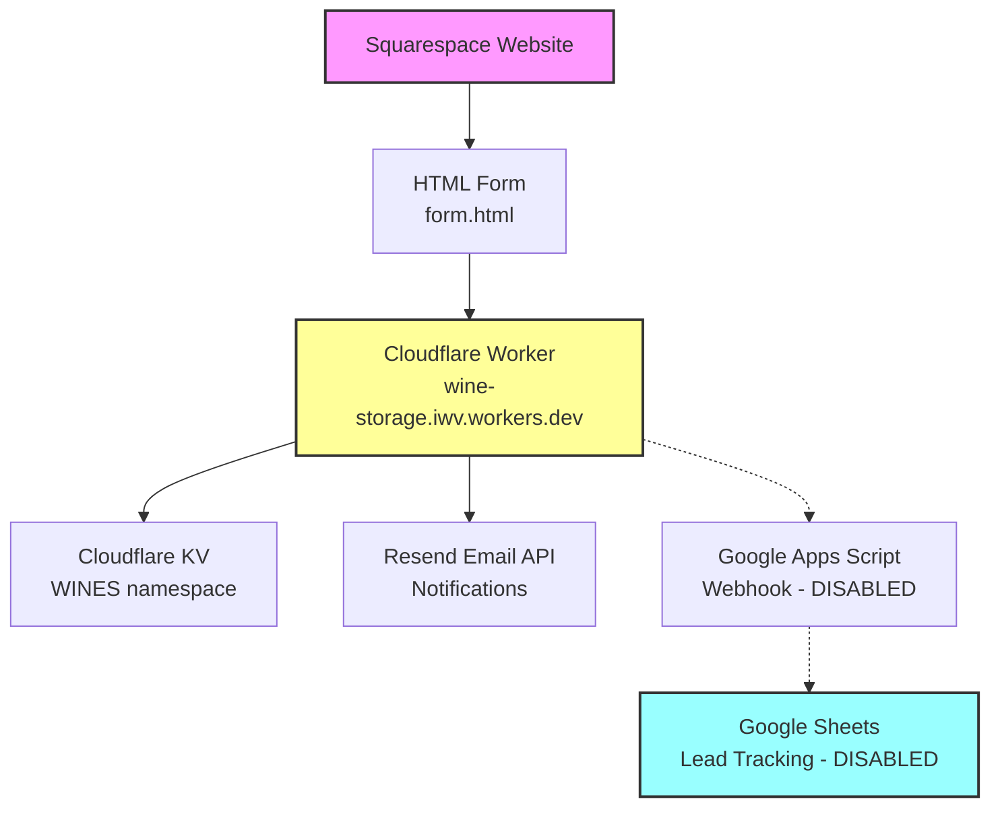
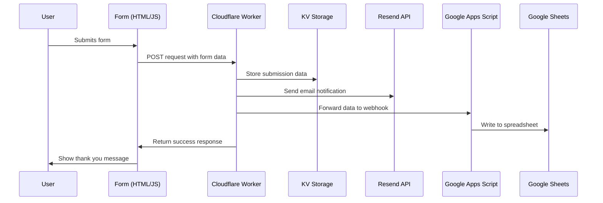

# Wine Storage Form System

A complete lead capture system for wine storage services, featuring a Squarespace-compatible form that collects customer inquiries and automatically processes them through email notifications and cloud storage.

## ⚠️ Google Sheets Integration Status

**Google Sheets functionality has been disabled at client request** but can be easily re-enabled. The integration code remains in the codebase (`src/index.js` lines 95-124) but is commented out. To re-integrate Google Sheets:

1. **Uncomment the Google Sheets code** in `src/index.js` (remove the `/*` and `*/` around the sheets integration)
2. **Update the Apps Script deployment** if needed using `csv_script.gs`
3. **Deploy the worker** with `wrangler deploy`

The Google Apps Script webhook handler (`csv_script.gs`) and spreadsheet configuration remain intact and ready for use.

## 🏗️ System Architecture

## 📁 File Structure & Components

### Frontend Components
- **`form.html`** - Squarespace-compatible HTML form with robust JavaScript
  - Handles form submission via AJAX
  - Calculates pricing estimates based on case quantities
  - Manages user interaction and validation
  - Displays success/error messages

### Backend Components
- **`src/index.js`** - Cloudflare Worker (main backend)
  - Processes form submissions
  - Stores data in Cloudflare KV
  - Sends email notifications via Resend
  - Google Sheets integration (currently disabled)
  - Handles CORS and error management

- **`csv_script.gs`** - Google Apps Script webhook handler
  - Receives data from Cloudflare Worker
  - Writes submissions to Google Sheets
  - Manages spreadsheet headers automatically
  - Provides testing functions

### Configuration Files
- **`wrangler.jsonc`** - Cloudflare Worker configuration
- **`package.json`** - Node.js dependencies
- **`vitest.config.js`** - Testing configuration
- **`test/index.spec.js`** - Unit tests

## 🔄 Data Flow Diagram

## 🎯 Features

### Form Capabilities
- **Smart Pricing Calculator**: Automatic cost estimation based on case quantities
- **Robust Validation**: Client-side validation with error handling
- **Squarespace Integration**: Compatible with Squarespace's injection system
- **Mobile Responsive**: Works on all device sizes
- **Bot Protection**: Simple checkbox verification

### Backend Processing
- **Multi-Channel Storage**: Data saved to both Cloudflare KV and Google Sheets
- **Email Notifications**: Formatted HTML emails sent via Resend
- **Error Handling**: Comprehensive logging and graceful failure recovery
- **CORS Support**: Cross-origin requests from any domain

### Data Management
- **Real-time Sync**: Immediate data availability across all platforms
- **Automatic Headers**: Google Sheets headers created automatically
- **Timestamping**: All submissions include precise timestamps
- **User Agent Tracking**: Browser/device information capture

## 🏢 Service Accounts & Configuration

### Cloudflare Account
- **Email**: currently set to dta35@cornell.edu, can be switched
- **Worker Name**: `wine-storage`
- **Custom Domain**: `wine-storage.iwv.workers.dev`
- **KV Namespace**: `WINES` (ID: `c93a28dcff3f4aa48003255eb3783390`)

### Resend Email Service (IWV Account)
- **Account Email**: `info@intlwinevault.com`
- **Service**: Resend (IWV account)
- **API Key**: (stored as Worker secret)
- **From Address**: `onboarding@resend.dev` (default Resend domain)
- **To Address**: `info@intlwinevault.com`
- **Domain Status**: Using default Resend domain

### Google Cloud Platform
- **Email**:currently set to dta35@cornell.edu, can be switched
- **Deployment ID**: `AKfycbxjGIwt8YXfz4jmOcLqM8-2nMWMS2WM1IzdE92sSZdsS6G0AiWRe49EcJD4LE0A3OhG`
- **Webhook URL**: `https://script.google.com/macros/s/AKfycbxjGIwt8YXfz4jmOcLqM8-2nMWMS2WM1IzdE92sSZdsS6G0AiWRe49EcJD4LE0A3OhG/exec`
- **Spreadsheet ID**: `1SeBx16Skhzg5NRZR3ghM_sj_SRt6fGS2fgkij7lR9Gw`

## 📊 Rate Limits & Quotas (Free Tier)

### Cloudflare Workers (Free Plan)
- **Daily Requests**: 100,000 requests/day
- **CPU Time**: 10ms per request
- **Memory**: 128MB
- **KV Operations**: 
  - Reads: 100,000/day
  - Writes: 1,000/day
  - Storage: 1GB total (roughly 2.6 million entries, assuming 415 bytes per entry)
- **Monthly Cost**: $0

### Resend (Free Plan)
- **Monthly Emails**: 3,000 emails/month
- **Daily Emails**: 100 emails/day
- **Rate Limit**: 10 emails/second
- **Domain Limit**: 1 verified domain
- **Monthly Cost**: $0

### Google Apps Script (Free Plan)
- **Script Runtime**: 6 minutes per execution
- **Triggers**: 20 script triggers
- **Daily Execution Time**: 6 hours/day
- **Email Quota**: 100 emails/day
- **URL Fetch**: 20,000 calls/day
- **Monthly Cost**: $0

### Google Sheets (Free Plan)
- **Spreadsheet Limit**: No specific limit
- **Cell Limit**: 10 million cells per spreadsheet
- **API Calls**: 300 requests/minute per project
- **Monthly Cost**: $0

## 📈 Scaling Considerations

When approaching free tier limits:

### Cloudflare Workers → Paid Plan ($5/month)
- 10M requests/month
- Additional KV storage available

### Resend → Paid Plan ($20/month)  
- 50,000 emails/month
- Custom domain verification

### Google Workspace → Paid Plan ($6/user/month)
- Higher API quotas
- Advanced admin controls

