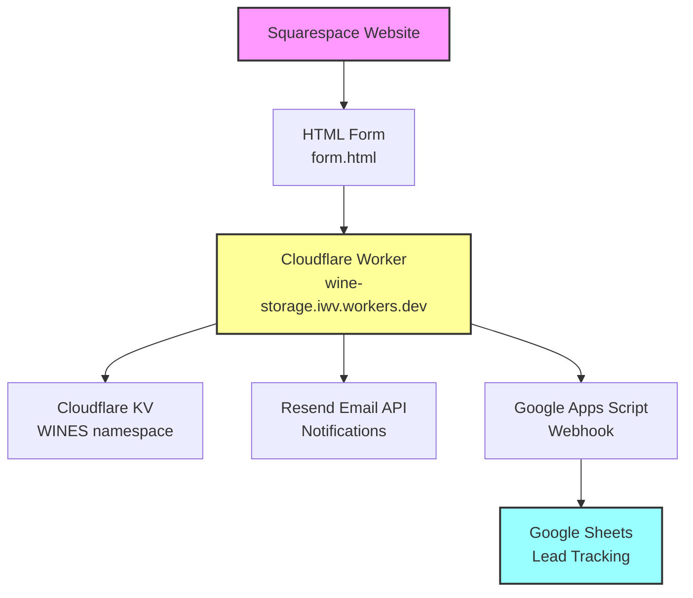
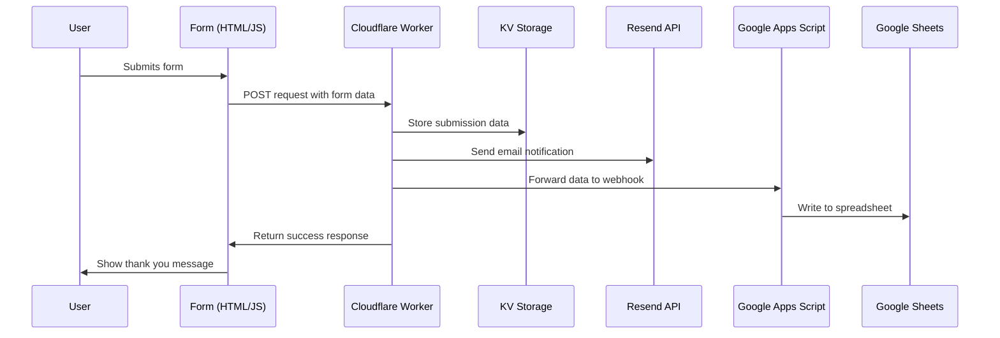

# Wine Storage Form System

A complete lead capture system for wine storage services, featuring a Squarespace-compatible form that collects customer inquiries and automatically processes them through multiple channels: email notifications, cloud storage, and Google Sheets tracking.

## 🏗️ System Architecture



## 📁 File Structure & Components

### Frontend Components
- **`form.html`** - Squarespace-compatible HTML form with robust JavaScript
  - Handles form submission via AJAX
  - Calculates pricing estimates based on case quantities
  - Manages user interaction and validation
  - Displays success/error messages

- **`example.html`** - Standalone demo version for testing outside Squarespace

### Backend Components
- **`src/index.js`** - Cloudflare Worker (main backend)
  - Processes form submissions
  - Stores data in Cloudflare KV
  - Sends email notifications via Resend
  - Forwards data to Google Apps Script webhook
  - Handles CORS and error management

- **`csv_script.gs`** - Google Apps Script webhook handler
  - Receives data from Cloudflare Worker
  - Writes submissions to Google Sheets
  - Manages spreadsheet headers automatically
  - Provides testing functions

### Configuration Files
- **`wrangler.jsonc`** - Cloudflare Worker configuration
- **`package.json`** - Node.js dependencies
- **`vitest.config.js`** - Testing configuration
- **`test/index.spec.js`** - Unit tests

## 🔄 Data Flow Diagram



## 🎯 Features

### Form Capabilities
- **Smart Pricing Calculator**: Automatic cost estimation based on case quantities
- **Robust Validation**: Client-side validation with error handling
- **Squarespace Integration**: Compatible with Squarespace's injection system
- **Mobile Responsive**: Works on all device sizes
- **Bot Protection**: Simple checkbox verification

### Backend Processing
- **Multi-Channel Storage**: Data saved to both Cloudflare KV and Google Sheets
- **Email Notifications**: Formatted HTML emails sent via Resend
- **Error Handling**: Comprehensive logging and graceful failure recovery
- **CORS Support**: Cross-origin requests from any domain

### Data Management
- **Real-time Sync**: Immediate data availability across all platforms
- **Automatic Headers**: Google Sheets headers created automatically
- **Timestamping**: All submissions include precise timestamps
- **User Agent Tracking**: Browser/device information capture

## 🏢 Service Accounts & Configuration

### Cloudflare Account
- **Email**: `[YOUR_CLOUDFLARE_EMAIL]`
- **Worker Name**: `wine-storage`
- **Custom Domain**: `wine-storage.iwv.workers.dev`
- **KV Namespace**: `WINES` (ID: `c93a28dcff3f4aa48003255eb3783390`)

### Resend Email Service
- **Email**: `[YOUR_RESEND_ACCOUNT_EMAIL]`
- **API Key**: `[YOUR_RESEND_API_KEY]` (stored as Worker secret)
- **From Address**: `onboarding@resend.dev` (sandbox domain)
- **To Address**: `dta35@cornell.edu`
- **Domain Status**: Using sandbox (intlwinevault.com unverified)

### Google Cloud Platform
- **Email**: `[YOUR_GOOGLE_ACCOUNT_EMAIL]`
- **Apps Script Project**: `[YOUR_APPS_SCRIPT_PROJECT_NAME]`
- **Deployment ID**: `AKfycbxjGIwt8YXfz4jmOcLqM8-2nMWMS2WM1IzdE92sSZdsS6G0AiWRe49EcJD4LE0A3OhG`
- **Webhook URL**: `https://script.google.com/macros/s/AKfycbxjGIwt8YXfz4jmOcLqM8-2nMWMS2WM1IzdE92sSZdsS6G0AiWRe49EcJD4LE0A3OhG/exec`
- **Spreadsheet ID**: `1SeBx16Skhzg5NRZR3ghM_sj_SRt6fGS2fgkij7lR9Gw`

## 📊 Rate Limits & Quotas (Free Tier)

### Cloudflare Workers (Free Plan)
- **Daily Requests**: 100,000 requests/day
- **CPU Time**: 10ms per request
- **Memory**: 128MB
- **KV Operations**: 
  - Reads: 100,000/day
  - Writes: 1,000/day
  - Storage: 1GB total (roughly 2.6 million entries, assuming 415 bytes per entry)
- **Monthly Cost**: $0

### Resend (Free Plan)
- **Monthly Emails**: 3,000 emails/month
- **Daily Emails**: 100 emails/day
- **Rate Limit**: 10 emails/second
- **Domain Limit**: 1 verified domain
- **Monthly Cost**: $0

### Google Apps Script (Free Plan)
- **Script Runtime**: 6 minutes per execution
- **Triggers**: 20 script triggers
- **Daily Execution Time**: 6 hours/day
- **Email Quota**: 100 emails/day
- **URL Fetch**: 20,000 calls/day
- **Monthly Cost**: $0

### Google Sheets (Free Plan)
- **Spreadsheet Limit**: No specific limit
- **Cell Limit**: 10 million cells per spreadsheet
- **API Calls**: 300 requests/minute per project
- **Monthly Cost**: $0

## 🚀 Deployment Instructions

### 1. Cloudflare Worker Setup
```bash
# Install dependencies
npm install

# Configure Wrangler (first time only)
npx wrangler login

# Set up secrets
npx wrangler secret put RESEND_KEY

# Deploy worker
npx wrangler deploy

# Monitor logs (optional)
npx wrangler tail
```

### 2. Google Apps Script Setup
1. Go to [Google Apps Script](https://script.google.com/)
2. Create new project
3. Paste contents of `csv_script.gs`
4. Save project
5. Deploy as web app:
   - Execute as: Me
   - Who has access: Anyone
6. Copy deployment URL
7. Run `setupHeaders()` function to initialize spreadsheet

### 3. Form Integration
1. Copy `form.html` content
2. Inject into Squarespace via Code Injection
3. Update worker URL if needed
4. Test form submission

## 📋 GitHub Integration

### Initial Repository Setup
```bash
# Initialize git repository
git init

# Add all files
git add .

# Create initial commit
git commit -m "Initial wine storage form system"

# Add GitHub remote (replace with your repository)
git remote add origin https://github.com/[YOUR_USERNAME]/wine-storage.git

# Push to GitHub
git push -u origin main
```

### Recommended Repository Structure
```
wine-storage/
├── README.md
├── package.json
├── package-lock.json
├── wrangler.jsonc
├── src/
│   └── index.js
├── test/
│   └── index.spec.js
├── docs/
│   ├── form.html
│   ├── example.html
│   └── csv_script.gs
└── .gitignore
```

### Environment Variables Management
Create `.env.example` file:
```bash
# Cloudflare Configuration
CLOUDFLARE_ACCOUNT_ID=your_account_id_here
CLOUDFLARE_API_TOKEN=your_api_token_here

# Resend Configuration  
RESEND_KEY=your_resend_api_key_here

# Google Configuration
GOOGLE_SPREADSHEET_ID=1SeBx16Skhzg5NRZR3ghM_sj_SRt6fGS2fgkij7lR9Gw
GOOGLE_APPS_SCRIPT_URL=https://script.google.com/macros/s/YOUR_DEPLOYMENT_ID/exec
```

### Continuous Deployment (Optional)
Set up GitHub Actions for automatic deployment:

```yaml
# .github/workflows/deploy.yml
name: Deploy to Cloudflare Workers

on:
  push:
    branches: [ main ]

jobs:
  deploy:
    runs-on: ubuntu-latest
    steps:
      - uses: actions/checkout@v3
      - uses: actions/setup-node@v3
        with:
          node-version: '18'
      - run: npm ci
      - run: npx wrangler deploy
        env:
          CLOUDFLARE_API_TOKEN: ${{ secrets.CLOUDFLARE_API_TOKEN }}
```

### Security Best Practices
1. **Never commit API keys** - Use `.gitignore` for sensitive files
2. **Use Wrangler secrets** for production API keys
3. **Rotate keys regularly** - Update API keys quarterly
4. **Monitor usage** - Set up alerts for quota limits
5. **Backup data** - Regular exports of Google Sheets data

## 🔧 Troubleshooting

### Common Issues
1. **Form not submitting**: Check browser console for JavaScript errors
2. **Emails not sending**: Verify Resend API key and domain status
3. **Sheets not updating**: Check Apps Script execution logs
4. **CORS errors**: Ensure proper headers in Cloudflare Worker

### Monitoring & Logs
- **Cloudflare**: `npx wrangler tail`
- **Google Apps Script**: Executions tab in Apps Script editor
- **Resend**: Dashboard at resend.com
- **Form**: Browser developer tools console

## 📈 Scaling Considerations

When approaching free tier limits:

### Cloudflare Workers → Paid Plan ($5/month)
- 10M requests/month
- Additional KV storage available

### Resend → Paid Plan ($20/month)  
- 50,000 emails/month
- Custom domain verification

### Google Workspace → Paid Plan ($6/user/month)
- Higher API quotas
- Advanced admin controls

---

## 🤝 Contributing

1. Fork the repository
2. Create feature branch (`git checkout -b feature/new-feature`)
3. Commit changes (`git commit -am 'Add new feature'`)
4. Push to branch (`git push origin feature/new-feature`)
5. Create Pull Request

## 📝 License

This project is licensed under the MIT License - see the LICENSE file for details. 
